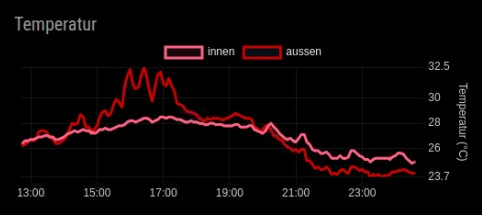
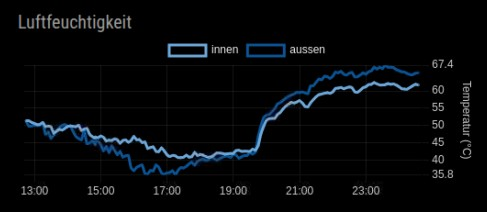

# MMM-LineChartJS

MagicMirror² module for drawing time-series sensor data as one or more Chart.js line graphs.

What it does
- Loads a JSON data source from either a remote URL or a local file path.
- Accepts an array of records or a single object and keeps only entries with a valid timestamp.
- Filters the data window to the latest `hoursToDisplay` hours before drawing.
- Supports multiple datasets in one chart using `chartConfig` entries.
- Lets each line use its own y-axis position, axis label, auto-scaling, smoothing, point styling, and gap handling.
- Dynamically loads Chart.js and the date-fns adapter from a CDN when the module starts.

Data format
The source JSON should be an array of objects, where each object contains a timestamp field and the numeric values you want to plot.

Example:

```json
[
  {
    "timestamp": "2025-06-12T20:22:06",
    "temperature": 27.5,
    "humidity": 45
  },
  {
    "timestamp": "2025-06-12T20:23:09",
    "temperature": 27.5,
    "humidity": 45.1
  }
]
```

Installation
```bash
cd ~/MagicMirror/modules
git clone https://github.com/MichiScl/MMM-LineChartJS.git
cd MMM-LineChartJS
npm install
```

Example configuration

This example mirrors the actual two-instance configuration used in the provided config.js:

```js
{
  module: "MMM-LineChartJS",
  position: "bottom_left",
  config: {
    chartId: "chart1",
    dataFileUrl: "http://192.168.178.59/sensordata/dht_sensor_data.json",
    updateInterval: 600000,
    hoursToDisplay: 12,
    maxDataPoints: 5000,
    chartWidth: 500,
    chartHeight: 180,
    chartTitle: "Temperatur",
    xDataID: "timestamp",
    xDataTimeFormat: "DD.MM.YYYYTHH:MM:SS",
    xAxisDisplayFormat: "HH:mm",
    xAxisPosition: "bottom",
    xAxisLabel: "Uhrzeit",
    xAxisLabelShow: false,
    xAxisAutoTicks: true,
    xAxisTickSteps: 1,
    chartConfig: [
      {
        smoothingFactor: 0,
        connectGaps: true,
        responsive: true,
        chartLabel: "innen",
        showChartLabel: true,
        lineColor: "rgb(255, 99, 132)",
        backgroundColor: "rgba(255, 99, 132, 0.1)",
        fillGraph: false,
        pointRadius: 1,
        pointHoverRadius: 5,
        yDataID: "temp_innen",
        yAxisAutoScale: true,
        yAxisShow: true,
        yAxisPosition: "left",
        yAxisLabel: "Temperatur (°C)",
        yAxisLabelShow: true,
        yAxisAutoTicks: true
      },
      {
        smoothingFactor: 0,
        connectGaps: true,
        responsive: true,
        chartLabel: "aussen",
        showChartLabel: true,
        lineColor: "rgb(204, 0, 0)",
        backgroundColor: "rgba(54, 162, 235, 0.1)",
        fillGraph: false,
        pointRadius: 1,
        pointHoverRadius: 5,
        yDataID: "temp_aussen",
        yAxisAutoScale: true,
        yAxisShow: false,
        yAxisPosition: "left",
        yAxisLabel: "Temperatur (°C)",
        yAxisLabelShow: false,
        yAxisAutoTicks: true
      },
      {
        smoothingFactor: 0,
        connectGaps: true,
        responsive: true,
        chartLabel: "innen",
        showChartLabel: true,
        lineColor: "rgb(111, 168, 220)",
        fillGraph: false,
        pointRadius: 1,
        pointHoverRadius: 5,
        yDataID: "hum_innen",
        yAxisAutoScale: true,
        yAxisShow: true,
        yAxisPosition: "right",
        yAxisLabel: "Temperatur (°C)",
        yAxisLabelShow: true,
        yAxisAutoTicks: true
      },
      {
        smoothingFactor: 0,
        connectGaps: true,
        responsive: true,
        chartLabel: "aussen",
        showChartLabel: true,
        lineColor: "rgb(11, 83, 148)",
        fillGraph: false,
        pointRadius: 1,
        pointHoverRadius: 5,
        yDataID: "hum_aussen",
        yAxisAutoScale: true,
        yAxisShow: false,
        yAxisPosition: "right",
        yAxisLabelShow: false,
        yAxisAutoTicks: true
      }
    ]
  }
},
{
  module: "MMM-LineChartJS",
  position: "bottom_center",
  config: {
    chartId: "chart2",
    dataFileUrl: "http://192.168.178.59/sensordata/dht_sensor_data.json",
    updateInterval: 600000,
    hoursToDisplay: 12,
    maxDataPoints: 5000,
    chartWidth: 500,
    chartHeight: 180,
    chartTitle: "Luftfeuchtigkeit",
    xDataID: "timestamp",
    xDataTimeFormat: "DD.MM.YYYYTHH:MM:SS",
    xAxisDisplayFormat: "HH:mm",
    xAxisPosition: "bottom",
    xAxisLabel: "Uhrzeit",
    xAxisLabelShow: false,
    xAxisAutoTicks: true,
    xAxisTickSteps: 1,
    chartConfig: [
      {
        smoothingFactor: 0,
        connectGaps: true,
        responsive: true,
        chartLabel: "innen",
        showChartLabel: true,
        lineColor: "rgb(111, 168, 220)",
        fillGraph: false,
        pointRadius: 1,
        pointHoverRadius: 5,
        yDataID: "hum_innen",
        yAxisAutoScale: true,
        yAxisShow: true,
        yAxisPosition: "right",
        yAxisLabel: "Temperatur (°C)",
        yAxisLabelShow: true,
        yAxisAutoTicks: true
      },
      {
        smoothingFactor: 0,
        connectGaps: true,
        responsive: true,
        chartLabel: "aussen",
        showChartLabel: true,
        lineColor: "rgb(11, 83, 148)",
        fillGraph: false,
        pointRadius: 1,
        pointHoverRadius: 5,
        yDataID: "hum_aussen",
        yAxisAutoScale: true,
        yAxisShow: false,
        yAxisPosition: "right",
        yAxisLabelShow: false,
        yAxisAutoTicks: true
      }
    ]
  }
}
```

## Display Preview

These screenshots show the module in use with two chart instances:





Configuration highlights
- `chartId`: unique identifier for each chart instance. Required when using multiple charts.
- `dataFileUrl`: remote URL or local file path for the JSON source.
- `updateInterval`: how often the helper should fetch fresh data. Default: `60000`
- `hoursToDisplay`: keep only records from the last N hours. Default: `24`
- `maxDataPoints`: cap the number of points displayed after filtering.
- `xDataID`: key used for the x-axis timestamp.
- `xDataTimeFormat`: optional timestamp parsing hint, or `undefined` to use automatic parsing.
- `chartConfig`: array of line definitions for the chart.

Each `chartConfig` entry can configure:
- `yDataID`: the JSON field for that line
- `chartLabel`: legend label
- `lineColor`, `backgroundColor`, `fillGraph`
- `pointRadius`, `pointHoverRadius`
- `smoothingFactor`: moving-average smoothing; `0` disables it
- `connectGaps`: whether missing data points should be connected
- `yAxisPosition`, `yAxisLabel`, `yAxisShow`
- `yAxisAutoScale`, `yAxisMin`, `yAxisMax`
- `yAxisAutoTicks`, `yAxisTickSteps`

Runtime behavior
- The node helper reads the JSON, converts timestamps to `Date` objects, and filters entries outside the configured time window.
- When `maxDataPoints` is set, the newest N points are kept.
- The frontend creates one canvas per chart instance and redraws the chart when new data arrives.
- Missing or invalid y values are kept as `null` so gaps can be rendered instead of being dropped entirely.
- If no valid data remains, the module shows a status message rather than rendering a broken chart.

Dependencies
- `node-fetch`
- Chart.js is loaded at runtime from a CDN by the frontend.

License
MIT